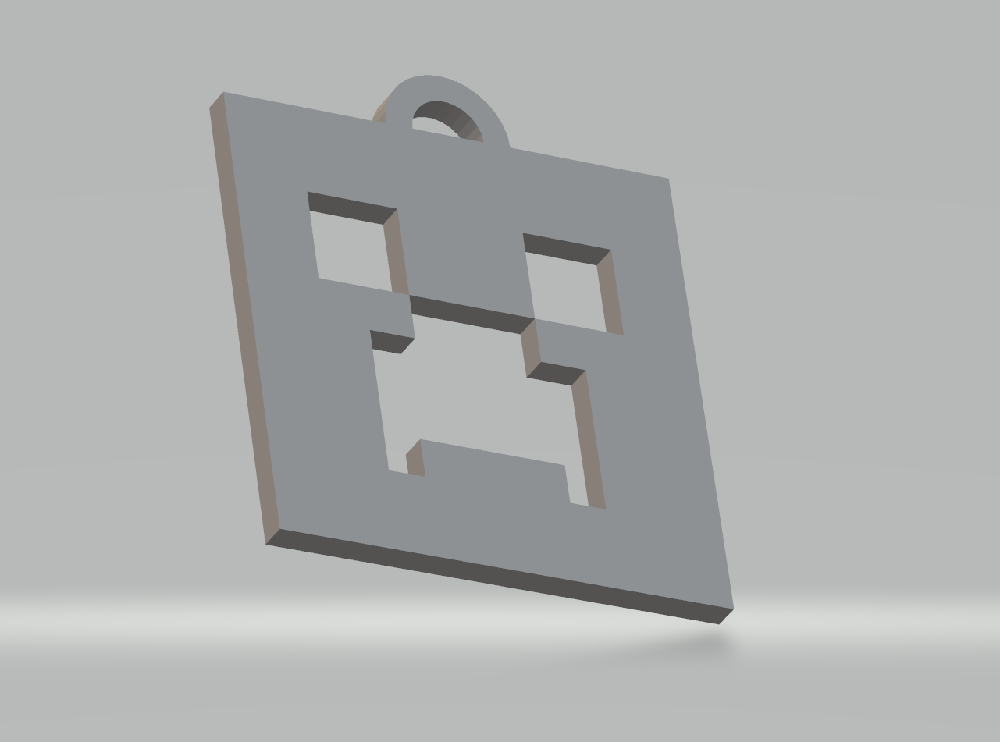
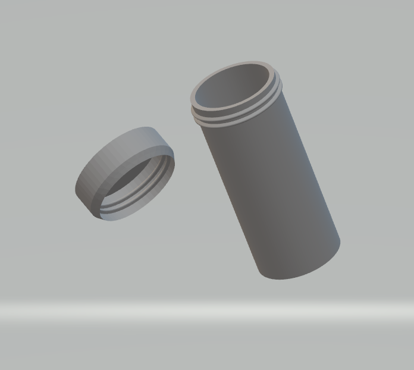
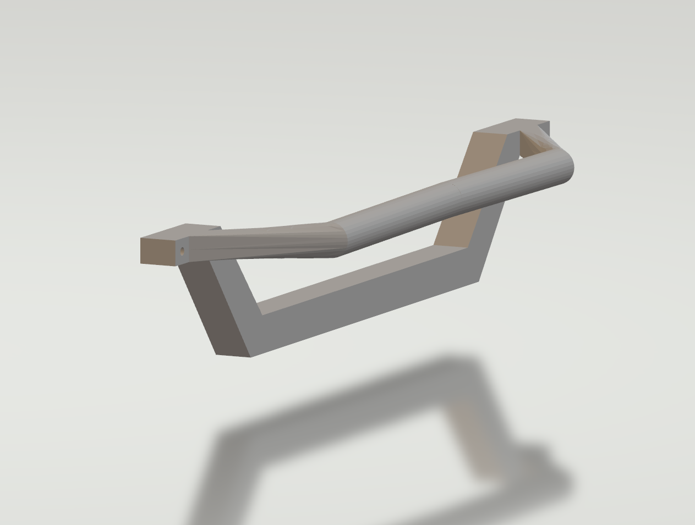

## 3D Models for Printing 🖨️

Below are the 3D models I created for 3D printing. Each model has a preview and links to the FreeCAD (FCStd) file and 3MF file ready for printing.

| Preview | Download (FCStd) | Download (3MF) |
|---------|-----------------|----------------|
|  | [creeper-minecraft-freecad.FCStd](freecad/creeper-minecraft-freecad.FCStd) | [creeper-minecraft-model.3mf](models/creeper-minecraft-model.3mf) |
|  | [cylinder_small-freecad.FCStd](freecad/cylinder_small-freecad.FCStd) | [cylinder_small-freecad-model-body.3mf](models/cylinder_small-freecad-model-body.3mf) [cylinder_small-freecad-model-lid.3mf](models/cylinder_small-freecad-model-lid.3mf) |
|  | [holder-for-glasses-freecad.FCStd](freecad/holder-for-glasses-freecad.FCStd) | [holder-for-glasses-freecad-model.3mf](models/holder-for-glasses-freecad-model.3mf) |
